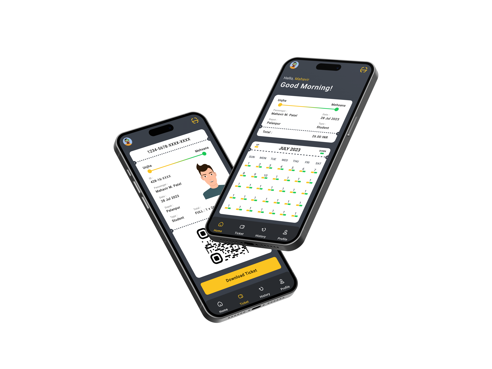

<h1>BusEase</h1>

The Revolutionary Bus Travel App for GSRTC in India

  

BusEase is a cutting-edge mobile application that aims to transform the way people travel by bus in the Indian state of Gujarat. Developed specifically for the Gujarat State Road Transport Corporation (GSRTC), BusEase offers a seamless and convenient experience for students and passengers alike.

  

##  Key Features

  

-  **Digital Bus Pass Application for Students**: Submit pass requests directly to universities and receive digital passes upon approval, eliminating paperwork.

-  **Online Bus Ticketing**: Book bus tickets conveniently through the app, skipping long queues at counters.

-  **QR Code Verification**: Validate tickets and access real-time bus information using QR codes.

-  **UPI Payment Integration**: Enjoy secure and hassle-free payments through popular UPI apps.

-  **Real-time Bus Tracking**: Track the live location of buses and plan your journey effectively.

  

##  App UI

  

  

##  QR Code for Bus Verification

  

  

With BusEase, bus travel in Gujarat has never been easier. Download the app today and experience the future of public transportation. Available on Google Play Store and Apple App Store.

##  Stay Connected

  

- Website: [https://www.busease.com](https://busease.vercel.app/)

  

##  License

  

BusEase is created by [Mahavir Patel](https://mhvr.vercel.app/).